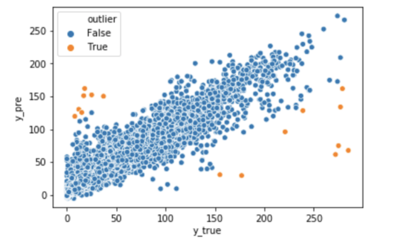

# Traffic_Flow_Prediction


### Task 

predicting average tollgate traffic volume


### Data

the initial training set contains data gathered from Sep. 19th to Oct. 17th, where data structures have been shown in table

|Attribute| Type |Description|
|----------|------------|------|
|tollgate_id| int | tollgateID|
|time window | string |  e.g. [2016-09-18 08:40:00, 2016-09-18 09:00:00] |
|direction | string | 0:entry, 1: exit |
|volume | int | total volume| 
|intersection_id| string |intersection ID |
|tollgate_id| int|tollgate ID|
|vehicle_id |int|vehicle ID|
|starting time| datetime|trajectory in the form of a sequence of link traces seperated by “;”, each trace consists of link ID, enter time, and travel time in seconds, separared by “#”.|
|travel_seq| string|the total time (in seconds) that the vehicle takes to travel from the intersections to the tollgate|

### Data Preprocessing

- weather() : Create the one combined CSV file from two weather’s CSV file.
- exception(): To put factor that we can analyze for a special day, such as holiday, first and last day of a workday, and day of the week. This is because the volume of traffic could be affected by those factors. To facilitate training, another CSV file for the exaction date is made.
- dataPepare() :  the training dataset and test dataset are created based on the time window for every 20mins, from 2016-09-19 to 2016-10-17 and from 2016-10-18 and to 2016 – 10-24 respectively.
- run():  the volume counted to corresponding to t ollgated_id and direction to corresponded time.
- df_filter(): To facilitate training and test, make new columns for date, hour, minutes for each low,putting other columns based on the hour and period number. 
- get_train() and get_test(): Aggregate all CSV files that has been made through the steps.
- create_timeseiries(): Given time stamp in each row can be considered as time sires. Timeseries consist of four components including level, trend, seasonality, and noise. By choosing addictive decomposition in time-series,
all components are added together as follow:

```sh
y(t) = Level + Trend + Seasonality + Noise.

```
An additive model is linear where changes over time are consistently made by the same amount. Moreover, set the frequency by every 5 mins, the trend resulting from the convolution is linear least-squares extrapolated on both ends considering this many freq closest points. In our project, we only take Seasonality to analysis, since it represents the trend, showing repeating short-term cycle in the series. The results table is saved timeseiries.csv file to facilitate for combining other datasets.

### Model

Parameter Setting of Each Model

- Random Forest Regressor

max_features = ['sqrt'],
max_depth = [50, 56, 62, 68, 74, 80, 86, 92, 98, 104, 110], min_samples_split = [5, 10],
min_samples_leaf = [4,8],
bootstrap = [True, False]


- Gradient Boosting Regressor

learning_rate: [0.01,0.04,0.05,0.07] ,
Subsample : [0.9, 0.5, 0.2],
n _estimators : [100,500,1000], 
max _depth : [4,6,8]


- Grid Search Cross Validation setting

The scoring method is mean absolute percentage error(MAPE) with 5-fold cross- validation.

- Model Selection 

Based on the results from grid search cross validation,  the results of two model’s training score and test score in the following table.


|                         |MAPE on Train| MAPE on Test| Best Score of Grid Search|
|-------------------------|---------------|--------------|-----------------------|
| Random Forest Regressor |    0.48157095103 |  0.652443579960 | 0.702546627049 |
| Gradient Boosting Regressor |0.18700710377 |  0.397032308104 | 0.425920743036 |

   
### Results


The result shows the grid search cross-validation with 5- folds for the test dataset, meaning the prediction result has a clear increasing trend, while there are some outliers. The total number of outliers is 1, showing more than 100 volume difference than real volume. 13 out of 15 occur in the AM, while only 4 cases happen in PM. Tollage ID number 1 has 11 out of 15 cases in the outlier in direction number 0. This road connected with Intersection A and Intersection B.


### Referececes
GitHub Reference: https://github.com/12190143/Black-Swan

